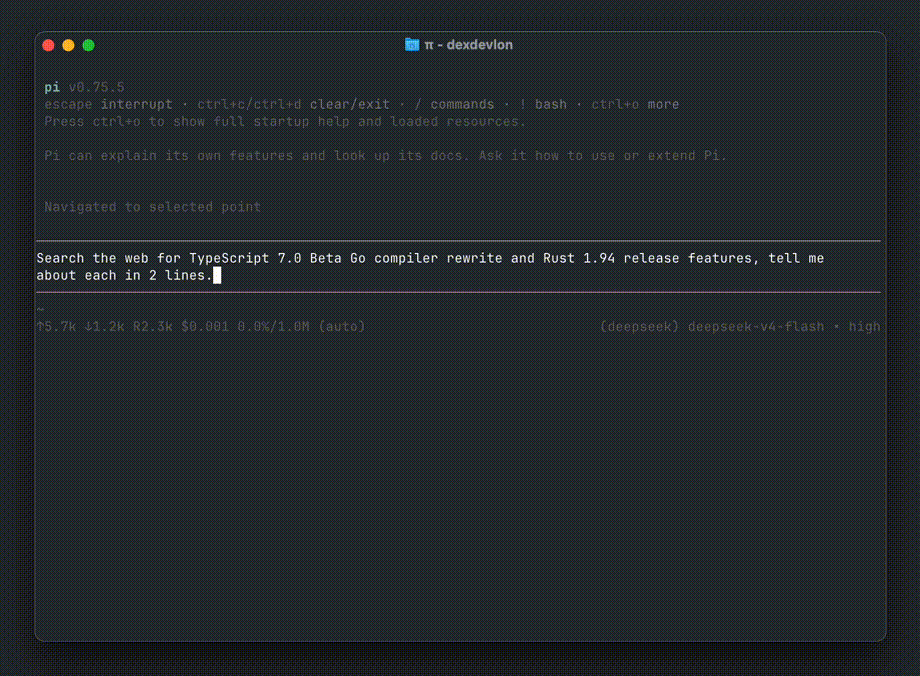

# pi-deepseek-search



```bash
pi install npm:pi-deepseek-search
```

Adds web search to Pi using DeepSeek's undocumented `web_search_20260209` server side tool. Only available on DeepSeek's Anthropic-compatible endpoint, so this switches your search calls there automatically. No extra API keys or config needed if you use DeepSeek in Pi.

## Limitations

Only works with DeepSeek models. The search runs on DeepSeek's servers during inference, so you can't use it with Anthropic, OpenAI, or any other provider.

Defaults to `deepseek-v4-flash`. Set `DEEPSEEK_SEARCH_MODEL` to change it.

Read more: [How I found DeepSeek's undocumented web search endpoint](https://musaab.io/posts/2026/deepseek-search)

[npm](https://www.npmjs.com/package/pi-deepseek-search) · [GitHub](https://github.com/bxff/pi-deepseek-search) · [pi.dev](https://pi.dev/packages/pi-deepseek-search)
